# Display path comparison: SpaceWalker vs ImmersiveStereoCompositor + P10 temporal depth

Artifacts from this session:

| File | Contents |
|------|----------|
| `viture-depth-ratio-export.c` | P10 `DepthRatioCalculator` only (~68 KB, focused IDA) |
| `p10-DepthRatioCalculator.metal` | Recovered Metal kernels from P10 binary strings |
| `spacewalker-ida-export-deep.c` | SpaceWalker `WideStripMetalRenderer` draw path |
| `ImmersiveStereoShaders.metal` | Your visionOS compositor shaders |

Re-run focused P10 export:
```bash
/Applications/IDA\ Professional\ 9.3.app/Contents/MacOS/idat -A \
  -S"KSPlayer/Tools/ida_export_viture_depth_ratio.py" \
  ~/Downloads/com.viture.p10app-1.9.25-Decrypted/ExternalMonitor
```

---

## Part 1 — P10 `computeWeightedRatio` (temporal depth)

### What it does

Stabilizes **depth maps between frames** before stereo shift — not stereo itself.

```
previous depth (R16Float MTLTexture)
current depth  (R16Float MTLTexture)
        ↓
computeWeightedRatio (16×16 threadgroups, atomics)
        ↓
CPU readback (kScaleFactor = 10000):
  • weighted average of (depth1/depth2) with radial × depth1 weighting
  • horizontal gradient gate (|Δdepth| > 0.5) for motion/scene-change detect
  • if grad/totalGrad > 0.5 → scale ratio by up to 1.3× (sub_1001A4A08)
        ↓
Adjusted depth fed to CIStereoShiftMetalFilter
```

### IDA (`sub_1001A4828` init)

- `MTLCreateSystemDefaultDevice` + command queue
- `sub_1001A5108`: `newLibraryWithSource:` embedded `DepthRatioCalculator.metal`, `newFunctionWithName: computeWeightedRatio`
- `newComputePipelineStateWithFunction`
- `CVMetalTextureCacheCreate`

### IDA (`sub_1001A4A08` dispatch)

- Converts both `CVPixelBuffer`s → `MTLTexture` **R16Float** via cache (`sub_1001A4F78`)
- Four 4-byte atomic buffers: `weightedSum`, `totalWeight`, `grad`, `totalGrad`
- `dispatchThreadgroups` with **16×16** threads per group
- **`waitUntilCompleted`** (synchronous — blocks until GPU done)
- Read atomics, divide by 10000, compute correction ratio

### Kernel highlights (`p10-DepthRatioCalculator.metal`)

| Mechanism | Detail |
|-----------|--------|
| Weight | Radial falloff from image center (`calculateWeight`) |
| Ratio | `depth1/depth2` when both in [0.005, 1.0] and `depth1 ≥ 0.07` |
| Weight boost | `weight *= depth1` (foreground pixels matter more) |
| Edge detect | Horizontal `curGrad = abs(depth[x]-depth[x+1])` |
| Color diff kernel | Separate `computeWeightedColorDiff` for RGB agreement (scale 100000) |

### What KSPlayer has today

| P10 | KSPlayer demo |
|-----|----------------|
| GPU cross-frame depth ratio | `DA3DepthGPUProcessor` temporal smoothing (Metal, different algorithm) |
| `computeWeightedRatio` atomics | `temporalSmoothingFactor` on depth pipeline |
| Sync GPU readback each frame | Async depth jobs; no ratio atomics |
| Applied **before** CI stereo | Depth smoothed in DA3 pipeline; compositor samples depth texture |

### Recommended port (minimal)

Add `ImmersiveDepthTemporalRatio.swift` + include `p10-DepthRatioCalculator.metal` in demo target:

1. Keep previous frame depth as `MTLTexture` (R16Float, same size as current).
2. Each DA3 frame: dispatch `computeWeightedRatio`, read ratio on CPU.
3. Scale current depth: `depth *= ratio` (or blend: `mix(prev, cur, 1/ratio)`).
4. Only when `grad/totalGrad ≤ 0.5` (scene stable); on hard cut, skip ratio.

This is **orthogonal** to your audio-sync video fix.

---

## Part 2 — SpaceWalker vs `ImmersiveStereoCompositor`

### Clock / frame selection

| | SpaceWalker `WideStripMetalRenderer` | KSPlayer `ImmersiveStereoCompositor` |
|---|--------------------------------------|--------------------------------------|
| **Wait** | `CVDisplayLink` callback | `LayerRenderer.queryNextFrame()` + `predictTiming()` |
| **When to draw** | Every display refresh | Every compositor frame; `clock.wait(until: optimalInputTime)` |
| **Frame pick** | Whatever is in `latestPixelBuffers` (last writer wins) | `ImmersiveVideoFeed.frame(forPresentationTime:)` — **audio-mastered PTS** |
| **Producer** | `SCStream` → handler pushes buffers | `MetalPlayView` drain → `immersivePresentVideoFrame` |
| **Sync model** | Live edge (mirror) | Presentation time from CompositorServices clock |

**Takeaway:** SpaceWalker is **“show the newest capture”**; your compositor is **“show the frame for this presentation instant”**. Your model is correct for file playback; SpaceWalker’s is correct for Mac screen mirror.

### Threading / buffer handoff

```
SpaceWalker:
  SCStream thread → lock → swap latestPixelBuffers[0..2]
  CVDisplayLink thread → lock → read array → draw

KSPlayer:
  MetalPlayView (main/display link) → ImmersiveVideoFeed.append (locked ring)
  Compositor thread → ImmersiveVideoFeed.frame(forPresentationTime:) → draw
```

Both use **lock + latest/ring buffer**. You already match the pattern; you added **timestamp selection** SpaceWalker does not need (live capture).

### Metal draw

| | SpaceWalker | ImmersiveStereoCompositor |
|---|-------------|---------------------------|
| **Output** | Single `CAMetalLayer` wide strip | Per-eye `LayerRenderer.Drawable` textures |
| **Geometry** | Multiple quads in a row (spacing ≈ 10 px) | One world-space quad per eye (`immersiveWorldVertex`) |
| **Input format** | BGRA8 via texture cache | NV12 + BGRA + rgba16Float paths |
| **Depth / stereo** | None — flat blit | `immersiveStereoUV` parallax from depth map |
| **Projection** | 2D strip layout in fragment/vertex buffer | MVP from `DeviceAnchor` + compositor layout |
| **Depth buffer** | None | Reverse-Z (`greaterEqual`, clear 0) |
| **Present** | Implicit drawable present | `drawable.encodePresent(commandBuffer:)` |

SpaceWalker draw loop (IDA `sub_1000AE0F0`):

```text
nextDrawable → for each CVPixelBuffer in latestPixelBuffers:
  CVMetalTextureCacheCreateTextureFromImage(BGRA8)
  compute strip width from aspect ratio
  drawPrimitives(triangle, 6)  // one quad
  advance X by width + spacing
commit
```

Your draw loop (`presentDrawable`):

```text
for each eye drawable:
  clear color (+ depth)
  if stereoFrame: drawVideo(NV12/BGRA + depth → immersiveStereoUV)
  else: placeholder shader
encodePresent → commit
```

### What to borrow from SpaceWalker

- **Nothing for stereo quality** — no depth, no per-eye warp.
- **Optional:** if you ever mirror Mac display to Vision Pro, the strip layout + IOSurface path is the reference (`sub_1000816A8`).

### What you already do better for immersive video

- Presentation-time frame selection (`forPresentationTime:`)
- Separate left/right eye with head anchor
- Depth-driven UV offset in shader
- YUV + extended linear for rgba16Float compositor targets

---

## Side-by-side architecture

```mermaid
flowchart TB
  subgraph p10_video [P10 ExternalMonitor — video 2D→3D]
    AV[AVPlayer + VideoOutput] --> DL[CADisplayLink]
    DL --> PB[curPixelBuffer]
    PB --> DA2[Depth Anything V2]
    DA2 --> DR[computeWeightedRatio]
    DR --> CI[CIStereoShiftMetalFilter]
    CI --> SBS[SBSFastView MTKView]
  end

  subgraph spacewalker [SpaceWalker — Mac mirror]
    SC[SCStream] --> LB[latestPixelBuffers lock]
    LB --> CDL[CVDisplayLink]
    CDL --> WS[WideStripMetalRenderer BGRA quads]
  end

  subgraph ksplayer [KSPlayer demo — visionOS immersive]
    MP[MetalPlayView display link] --> IF[ImmersiveVideoFeed ring PTS]
    DA3[KSVideoFrameOutput DA3 only] --> Depth[DA3 depth map]
    IF --> Comp[ImmersiveStereoCompositor LayerRenderer clock]
    Depth --> Comp
    Comp --> CS[CompositorServices per-eye encodePresent]
  end
```



---

## Action items (priority)

1. **Done / keep:** audio-synced `ImmersiveVideoFeed` + pre-wired FFmpeg (not SpaceWalker’s live-edge model).
2. **Next quality win:** port `computeWeightedRatio` from `p10-DepthRatioCalculator.metal` into demo depth path.
3. **Do not port:** SpaceWalker wide-strip renderer for visionOS immersive — wrong output model.
4. **Reference:** P10 `VTDepthVideoPlayer` display-link gating remains the analogue for **when** to accept a video frame, not SpaceWalker.
